本文汇总 Firefly Astro 博客主题自带的示例文章，集中介绍博客配置、文章编写、布局系统、Markdown 扩展、代码块、图表、加密内容和多媒体嵌入等功能。


---

## Firefly 代码块示例

在这里，我们将探索如何使用 [Expressive Code](https://expressive-code.com/) 展示代码块。提供的示例基于官方文档，您可以参考以获取更多详细信息。

## 表达性代码

### 语法高亮

[语法高亮](https://expressive-code.com/key-features/syntax-highlighting/)

#### 常规语法高亮

```js
console.log('此代码有语法高亮!')
```

#### 渲染 ANSI 转义序列

```ansi
Standard ANSI colors:
- Dimmed:      Black  Red  Green  Yellow  Blue  Magenta  Cyan  White 
- Foreground:  Black  Red  Green  Yellow  Blue  Magenta  Cyan  White 
- Background:  Black  Red  Green  Yellow  Blue  Magenta  Cyan  White 
- Reversed:    Black  Red  Green  Yellow  Blue  Magenta  Cyan  White 

8-bit colors (showing colors 160-171 as an example):
- Dimmed:      160  161  162  163  164  165  166  167  168  169  170  171 
- Foreground:  160  161  162  163  164  165  166  167  168  169  170  171 
- Background:  160  161  162  163  164  165  166  167  168  169  170  171 
- Reversed:    160  161  162  163  164  165  166  167  168  169  170  171 

24-bit colors (full RGB):
- Dimmed:      ForestGreen - RGB(34,139,34)  RebeccaPurple - RGB(102,51,153) 
- Foreground:  ForestGreen - RGB(34,139,34)  RebeccaPurple - RGB(102,51,153) 
- Background:  ForestGreen - RGB(34,139,34)  RebeccaPurple - RGB(102,51,153) 
- Reversed:    ForestGreen - RGB(34,139,34)  RebeccaPurple - RGB(102,51,153) 

Font styles:
- Default
- Bold
- Dimmed
- Italic
- Underline
- Reversed
- Strikethrough
```

### 编辑器和终端框架

[编辑器和终端框架](https://expressive-code.com/key-features/frames/)

#### 代码编辑器框架

```js title="my-test-file.js"
console.log('标题属性示例')
```

---

```html
<!-- src/content/index.html -->
<div>文件名注释示例</div>
```

#### 终端框架

```bash
echo "此终端框架没有标题"
```

---

```powershell title="PowerShell 终端示例"
Write-Output "这个有标题!"
```

#### 覆盖框架类型

```sh frame="none"
echo "看，没有框架!"
```

---

```ps frame="code" title="PowerShell Profile.ps1"
# 如果不覆盖，这将是一个终端框架
function Watch-Tail { Get-Content -Tail 20 -Wait $args }
New-Alias tail Watch-Tail
```

### 文本和行标记

[文本和行标记](https://expressive-code.com/key-features/text-markers/)

#### 标记整行和行范围

```js {1, 4, 7-8}
// 第1行 - 通过行号定位
// 第2行
// 第3行
// 第4行 - 通过行号定位
// 第5行
// 第6行
// 第7行 - 通过范围 "7-8" 定位
// 第8行 - 通过范围 "7-8" 定位
```

#### 选择行标记类型 (mark, ins, del)

```js title="line-markers.js" del={2} ins={3-4} {6}
function demo() {
  console.log('此行标记为已删除')
  // 此行和下一行标记为已插入
  console.log('这是第二个插入行')

  return '此行使用中性默认标记类型'
}
```

#### 为行标记添加标签

```jsx {"1":5} del={"2":7-8} ins={"3":10-12}
// labeled-line-markers.jsx
<button
  role="button"
  {...props}
  value={value}
  className={buttonClassName}
  disabled={disabled}
  active={active}
>
  {children &&
    !active &&
    (typeof children === 'string' ? <span>{children}</span> : children)}
</button>
```

#### 在单独行上添加长标签

```jsx {"1. Provide the value prop here:":5-6} del={"2. Remove the disabled and active states:":8-10} ins={"3. Add this to render the children inside the button:":12-15}
// labeled-line-markers.jsx
<button
  role="button"
  {...props}

  value={value}
  className={buttonClassName}

  disabled={disabled}
  active={active}
>

  {children &&
    !active &&
    (typeof children === 'string' ? <span>{children}</span> : children)}
</button>
```

#### 使用类似 diff 的语法

```diff
+此行将标记为已插入
-此行将标记为已删除
这是常规行
```

---

```diff
--- a/README.md
+++ b/README.md
@@ -1,3 +1,4 @@
+this is an actual diff file
-all contents will remain unmodified
 no whitespace will be removed either
```

#### 结合语法高亮和类似 diff 的语法

```diff lang="js"
  function thisIsJavaScript() {
    // 整个块都会以 JavaScript 高亮显示，
    // 并且我们仍然可以为其添加 diff 标记！
-   console.log('要删除的旧代码')
+   console.log('新的闪亮代码！')
  }
```

#### 标记行内的单独文本

```js "given text"
function demo() {
  // 标记行内的任何给定文本
  return '支持给定文本的多个匹配项';
}
```

#### 正则表达式

```ts /ye[sp]/
console.log('单词 yes 和 yep 将被标记。')
```

#### 转义正斜杠

```sh /\/ho.*\//
echo "Test" > /home/test.txt
```

#### 选择内联标记类型 (mark, ins, del)

```js "return true;" ins="inserted" del="deleted"
function demo() {
  console.log('这些是插入和删除的标记类型');
  // return 语句使用默认标记类型
  return true;
}
```

### 自动换行

[自动换行](https://expressive-code.com/key-features/word-wrap/)

#### 为每个块配置自动换行

```js wrap
// 启用换行的示例
function getLongString() {
  return '这是一个非常长的字符串，除非容器极宽，否则很可能无法适应可用空间'
}
```

---

```js wrap=false
// wrap=false 的示例
function getLongString() {
  return '这是一个非常长的字符串，除非容器极宽，否则很可能无法适应可用空间'
}
```

#### 配置换行的缩进

```js wrap preserveIndent
// preserveIndent 示例（默认启用）
function getLongString() {
  return '这是一个非常长的字符串，除非容器极宽，否则很可能无法适应可用空间'
}
```

---

```js wrap preserveIndent=false
// preserveIndent=false 的示例
function getLongString() {
  return '这是一个非常长的字符串，除非容器极宽，否则很可能无法适应可用空间'
}
```

## 可折叠部分

[可折叠部分](https://expressive-code.com/plugins/collapsible-sections/)

```js collapse={1-5, 12-14, 21-24}
// 所有这些样板设置代码将被折叠
import { someBoilerplateEngine } from '@example/some-boilerplate'
import { evenMoreBoilerplate } from '@example/even-more-boilerplate'

const engine = someBoilerplateEngine(evenMoreBoilerplate())

// 这部分代码默认可见
engine.doSomething(1, 2, 3, calcFn)

function calcFn() {
  // 您可以有多个折叠部分
  const a = 1
  const b = 2
  const c = a + b

  // 这将保持可见
  console.log(`计算结果: ${a} + ${b} = ${c}`)
  return c
}

// 直到块末尾的所有代码将再次被折叠
engine.closeConnection()
engine.freeMemory()
engine.shutdown({ reason: '示例样板代码结束' })
```

## 行号

[行号](https://expressive-code.com/plugins/line-numbers/)

### 为每个块显示行号

```js showLineNumbers
// 此代码块将显示行号
console.log('来自第2行的问候!')
console.log('我在第3行')
```

---

```js showLineNumbers=false
// 此块禁用行号
console.log('你好?')
console.log('抱歉，你知道我在第几行吗?')
```

### 更改起始行号

```js showLineNumbers startLineNumber=5
console.log('来自第5行的问候!')
console.log('我在第6行')
```

## Tab 代码块

由 [rehype-code-group](https://github.com/ITZSHOAIB/rehype-code-group) 提供，语法与 [VitePress 代码组](https://vitepress.dev/guide/markdown#code-groups) 一致：用 `::: code-group labels=[...]` 包裹多个代码块，即可合并成一组标签页。

> [!NOTE]
> `labels=[...]` 中的标签按顺序对应组内的代码块，用英文逗号分隔；`:::` 与 `code-group` 之间的空格不能省略。

### 基本用法

````markdown
::: code-group labels=[code.js, code.py, code.html]

```js
export function greet(name) {
  return `Hello, ${name}!`;
}
```

```py
def greet(name):
    return f"Hello, {name}!"
```

```html
<p>Hello, world!</p>
```

:::
````

渲染效果：

::: code-group labels=[code.js, code.py, code.html]

```js
export function greet(name) {
  return `Hello, ${name}!`;
}
```

```py
def greet(name):
    return f"Hello, {name}!"
```

```html
<p>Hello, world!</p>
```

:::

### 标签中使用 Emoji

标签支持 [emoji 短代码](https://github.com/omnidan/node-emoji#readme)，构建时会自动转换成 emoji：

````markdown
::: code-group labels=[:package: npm, :package: pnpm, :yarn: yarn]
````

::: code-group labels=[:package: npm, :package: pnpm, :yarn: yarn]

```bash
npm create astro@latest
```

```bash
pnpm create astro@latest
```

```bash
yarn create astro
```

:::

### 与其他代码块特性组合

组内仍是普通的 Expressive Code 代码块，标题、行号、行标记、折叠、终端框架等特性都可以照常使用。

::: code-group labels=[配置文件, 终端, 折叠]

```js title="astro.config.mjs" showLineNumbers {2} ins={3}
export default {
  theme: "firefly",
  codeGroup: true,
};
```

```bash title="部署"
pnpm build && pnpm preview
```

```js collapse={1-3}
// 这三行默认折叠
import { a } from "a";
import { b } from "b";

console.log(a, b);
```

:::

### 不止是代码块

标签页内可以放任意内容，例如文字、列表或图片：

::: code-group labels=[说明, 列表]

这是一段普通的段落内容。

- 列表项一
- 列表项二

:::

> [!TIP]
> 标签栏在构建期生成，默认展开第一项；支持鼠标点击与键盘 <kbd>←</kbd> / <kbd>→</kbd> / <kbd>Home</kbd> / <kbd>End</kbd> 切换。


---

## 草稿示例

# 这篇文章是草稿

这篇文章目前处于草稿状态，尚未发布。因此，它不会对普通读者可见。内容仍在进行中，可能需要进一步编辑和审查。

当文章准备发布时，您可以在 Frontmatter 中将 "draft" 字段更新为 "false"：

```markdown
---
title: 草稿示例
published: 2024-01-11T04:40:26.381Z
tags: [Markdown, 博客, 演示]
category: 示例
draft: false
---


---

## Firefly 文章加密

## 成功解锁了这篇文章！

如果你能看到这段内容，说明密码输入正确，文章已成功解密。

### 功能说明

- **构建时加密**：文章内容在构建时使用 AES-256-GCM 算法加密，页面源码中不包含任何明文。
- **客户端解密**：访客输入正确密码后，浏览器通过 Web Crypto API 在本地完成解密。
- **会话缓存**：同一浏览器会话内，密码会被缓存到 `sessionStorage`，刷新页面无需重复输入。
- **关闭即失效**：关闭浏览器后缓存清除，再次访问需要重新输入密码。

> 密码为 `123456`，仅供测试使用。

## 图片


## GitHub 仓库卡片

::github{repo="CuteLeaf/Firefly"}

## 提示框

> [!NOTE] NOTE
> 突出显示用户应该考虑的信息。

> [!TIP] TIP
> 可选信息，帮助用户更成功。

> [!NOTE] 自定义标题
> 这是一个带有自定义标题的示例。

## 数学公式
### 行内公式 (Inline)

欧拉公式 $e^{i\pi} + 1 = 0$ 是数学中最优美的公式之一。

质能方程 $E = mc^2$ 也是家喻户晓。

### 块级公式 (Block)

块级公式使用两个 `$$` 符号包裹，会居中显示。

$$
\int_{-\infty}^{\infty} e^{-x^2} dx = \sqrt{\pi}
$$

$$
x = \frac{-b \pm \sqrt{b^2 - 4ac}}{2a}
$$

### 化学方程式 (Chemical Equations)

$$
\ce{CH4 + 2O2 -> CO2 + 2H2O}
$$

## 代码块
#### 常规语法高亮

```js
console.log('此代码有语法高亮!')
```

#### 渲染 ANSI 转义序列

```ansi
ANSI colors:
- Regular: Red Green Yellow Blue Magenta Cyan
- Bold:    Red Green Yellow Blue Magenta Cyan
- Dimmed:  Red Green Yellow Blue Magenta Cyan

256 colors (showing colors 160-177):
160 161 162 163 164 165
166 167 168 169 170 171
172 173 174 175 176 177

Full RGB colors:
ForestGreen - RGB(34, 139, 34)

Text formatting: Bold Dimmed Italic Underline
```


## 流程图

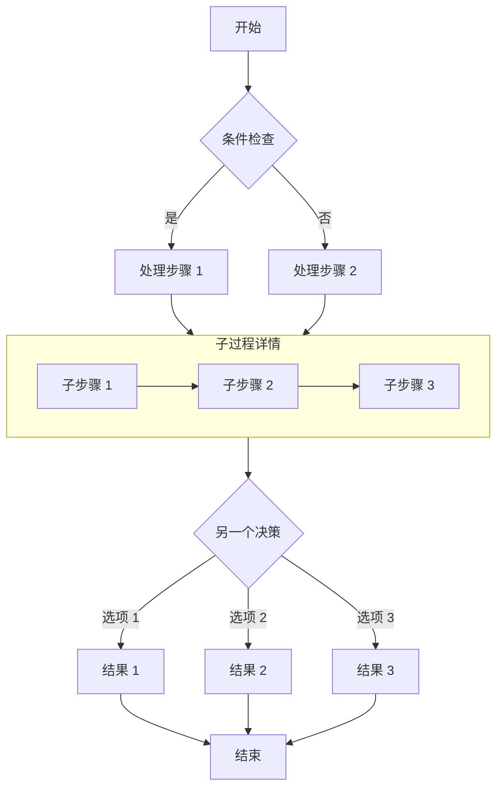


---

## Firefly 一款清新美观的 Astro 博客主题模板

## 🌟 项目概述

**Firefly** 是一款基于 Astro 框架和 Fuwari 模板开发的清新美观且现代化个人博客主题模板，专为技术爱好者和内容创作者设计。该主题融合了现代 Web 技术栈，提供了丰富的功能模块和高度可定制的界面，让您能够轻松打造出专业且美观的个人博客网站。


**🖥️在线预览： [Firefly - Demo site](https://firefly.cuteleaf.cn/)**

**🏠我的博客： [https://blog.cuteleaf.cn](https://blog.cuteleaf.cn/)**

**📝Firefly使用文档： [https://docs-firefly.cuteleaf.cn](https://docs-firefly.cuteleaf.cn/)**

**⭐Firefly开源地址：[https://github.com/CuteLeaf/Firefly](https://github.com/CuteLeaf/Firefly)** 

**⭐Fuwari开源地址：[https://github.com/saicaca/fuwari](https://github.com/saicaca/fuwari)**

::github{repo="CuteLeaf/Firefly"}

::github{repo="saicaca/fuwari"}


## 🚀 技术架构

- **静态站点生成**: 基于 Astro ，提供极快的加载速度和优秀的 SEO 优化
- **TypeScript 支持**: 完整的类型安全，提升开发体验和代码质量
- **响应式设计**: 使用 Tailwind CSS 构建，完美适配桌面端和移动端
- **组件化开发**: 支持 Astro、Svelte 组件，灵活可扩展


## 📖 配置说明

> 📚 **详细配置文档**: 查看 [Firefly 使用文档](https://docs-firefly.cuteleaf.cn/) 获取完整的配置指南


---

## Firefly 布局系统详解

## 📖 概述

Firefly 提供了灵活的布局系统，允许您根据内容需求和个人喜好自定义博客的视觉呈现方式。布局系统主要包括**侧边栏布局**和**文章列表布局**两个维度，它们相互配合，共同决定了页面的整体结构。

本文将详细介绍 Firefly 的各种布局模式、它们的特点、使用场景，以及不同布局组合的效果。

---

[grid]


[/grid]

[grid]


[/grid]


## 一、侧边栏布局系统

侧边栏是博客页面的重要组成部分，用于展示导航、分类、标签、统计信息等辅助内容。Firefly 支持两种侧边栏布局模式。

### 1.1 单侧边栏模式

#### 左侧边栏 (position: "left")


#### 右侧边栏 (position: "right")


#### 特点

- 侧边栏固定在页面其中一侧
- 文章阅读区域体验更佳，更宽敞
- 更加简约，没有那么紧凑

#### 适用场景

- 传统博客风格
- 强调导航和分类的博客
- 需要突出用户资料的个人博客
- 内容为主，辅助信息次之的场景

:::tip
可以通过showBothSidebarsOnPostPage配置是否在文章详情页显示双侧边栏

当position为left或right时开启此项后，文章详情页将显示双侧边栏，主页等其他页面保持单侧边栏

适用在只想用单侧栏，但在文章详情页想用对侧栏的目录等组件的场景
:::


#### 配置示例

```typescript
// src/config/sidebarConfig.ts
export const sidebarLayoutConfig: SidebarLayoutConfig = {
  enable: true,
  position: "left", // 左侧边栏
  showBothSidebarsOnPostPage: true, // 是否在文章详情页显示双侧边栏
};
```

---

### 1.2 双侧边栏模式 (position: "both")

#### 特点

- 左右两侧同时存在侧边栏
- 主内容区域位于中间
- 最大化利用屏幕空间
- 可以展示更多辅助信息
- 适合宽屏显示器

#### 布局结构


#### 适用场景

- 宽屏桌面端浏览
- 信息密集型博客
- 需要展示大量辅助内容
- 专业性强的技术博客


#### 配置示例

```typescript
// src/config/sidebarConfig.ts
export const sidebarLayoutConfig: SidebarLayoutConfig = {
  enable: true,
  position: "both", // 双侧边栏
```

---

## 二、文章列表布局系统

文章列表是博客首页和归档页的核心内容，Firefly 提供两种展示方式，并支持多种网格配置。

### 2.1 列表模式 (defaultMode: "list")

#### 特点

- 单列纵向排列
- 显示文章封面图，可配置在左侧或右侧
- 展示更多文章摘要
- 适合深度阅读

#### 列表布局结构


#### 封面位置

列表模式的封面图默认在卡片右侧，可以通过 `coverPosition` 改到左侧。改到左侧后，标题前的主题色竖线会自动隐藏（它是贴着卡片左边缘的设计），腾出的间距留给正文。

网格模式的封面固定在卡片顶部，不受这项配置影响。

#### 优点

- ✅ 视觉冲击力强，封面图吸引眼球
- ✅ 可以展示更多文章信息（摘要、标签等）
- ✅ 适合图片内容丰富的博客
- ✅ 移动端友好，单列更易阅读
- ✅ 兼容所有侧边栏配置（单侧、双侧）

#### 配置示例

```typescript
// src/config/siteConfig.ts
export const siteConfig: SiteConfig = {
  postListLayout: {
    defaultMode: "list",    // 列表模式
    coverPosition: "right", // 封面图位置："right" 右侧，"left" 左侧
  },
};
```

---

### 2.2 网格模式 (defaultMode: "grid")

#### 特点

- 自适应列数，根据浏览器宽度自动调整
- 紧凑布局，信息密度高
- 适合快速浏览

#### 自适应网格

网格模式通过 `columnWidth` 配置卡片的最小宽度（单位 px），浏览器会根据容器可用宽度自动计算能容纳多少列。


#### 配置示例

```typescript
// src/config/siteConfig.ts
export const siteConfig: SiteConfig = {
  postListLayout: {
    defaultMode: "grid",
    grid: {
      masonry: true,      // 开启瀑布流
      columnWidth: 320,   // 卡片最小宽度(px)，浏览器自动计算列数
    },
  },
};
```

---

### 2.3 瀑布流布局 (Masonry)

Firefly 的网格模式内置了智能瀑布流布局支持，解决了网格布局中因图文混合文章导致的卡片高度不一致导致的空白问题。


- **智能排版**：自动将卡片放置到最短的列，最大化利用垂直空间。
- **消除空白**：通过绝对定位精确计算每个卡片的位置，让卡片紧贴上方卡片，消除垂直方向的空白间隙。
- **自适应列数**：瀑布流同样根据 `columnWidth` 和容器宽度动态计算列数，无需固定配置。
- **配置灵活**：您可以在 `siteConfig.ts` 中通过 `postListLayout.grid.masonry` 选项自由开启或关闭此功能。

---

## 三、布局组合指南

Firefly 允许您自由组合侧边栏和文章列表布局。以下是各种组合的效果说明。

| 侧边栏模式 | 文章列表模式 | 推荐度 | 适用场景 |
|-----------|------------|--------|---------|
| 单侧边栏   | 列表模式    | ⭐⭐⭐⭐⭐ | 摄影、设计、生活类博客，强调图片和沉浸感 |
| 单侧边栏   | 网格模式    | ⭐⭐⭐⭐⭐ | 技术、笔记类博客，平衡阅读与检索效率 |
| 双侧边栏   | 列表模式    | ⭐⭐⭐⭐⭐ | 需要展示大量侧边栏信息的站点 |
| 双侧边栏   | 网格模式    | ⭐⭐⭐⭐⭐ | 极客风格，追求最高信息密度 |

---

## 四、响应式布局行为

Firefly 的布局系统具有智能的响应式设计，会根据屏幕尺寸自动调整。

为了保证最佳阅读体验，系统会在屏幕变窄时自动调整布局：

1. **网格列数自动减少**：网格模式的列数由 `columnWidth` 和容器宽度自动决定，屏幕越窄列数越少。
2. **列表模式 -> 网格模式**：当屏幕宽度小于 380px（超小屏设备）时，列表模式会自动切换为网格模式，以保证卡片内容的可读性。
3. **双侧边栏 -> 单侧边栏**：当屏幕宽度小于 1280px 时，会根据`tabletSidebar`配置显示单侧边栏，隐藏其中一个侧边栏，文章目录导航会切换成浮动目录导航。

---

## 五、常见问题

### Q1: 如何调整网格列数？

**A**: 通过 `columnWidth` 配置卡片最小宽度即可。值越小，同等宽度下列数越多；值越大，列数越少。浏览器会自动根据可用宽度计算最佳列数。

---

## 六、总结

Firefly 的布局系统给予了您更大的自由度，您都可以通过简单的配置实现。

我们建议您根据自己的内容类型和目标读者的设备偏好，尝试不同的组合，找到最适合您的博客形态。

---

## 相关链接

- 📚 [侧边栏配置文档](https://docs-firefly.cuteleaf.cn/config/sidebarConfig-usage/)
- 📚 [站点配置文档](https://docs-firefly.cuteleaf.cn/config/siteConfig-usage/)
- 🏠 [Firefly 官方文档](https://docs-firefly.cuteleaf.cn/)
- ⭐ [Firefly GitHub](https://github.com/CuteLeaf/Firefly)


---

## Firefly Wiki Link 内部链接示例

Firefly 支持在 Markdown、MDX 文章中使用 Obsidian 风格的 Wiki Link 内部链接。链接目标填写文章的 slug 或文件路径，都不需要包含扩展名，具体匹配规则见下文「链接目标的三种写法」。

## 文章链接卡片

`[[slug]]` 单独成段时，会自动读取目标文章的标题、描述、发布时间、分类、标签和封面，渲染为链接卡片：

```markdown
[[firefly]]

[[guide/index]]

[[markdown-extended]]
```

[[firefly]]

[[guide/index]]

[[markdown-extended]]

## 行内链接

`[[slug]]` 出现在正文中间时，渲染为普通链接，链接文字自动使用目标文章的标题

```markdown
请参阅 [[firefly]] 了解主题特性。
```

请参阅 [[firefly]] 了解主题特性。

## 自定义显示标题

在 `|` 后填写链接的显示文字。行内链接会用它替换文章标题；单独成段时依然渲染为卡片，卡片标题使用自定义文字，描述、时间、分类、标签和封面仍然读取目标文章：

```markdown
请参阅 [[firefly|主题介绍]] 了解主题特性。

[[firefly|Firefly 主题介绍]]
```

请参阅 [[firefly|主题介绍]] 了解主题特性。

[[firefly|Firefly 主题介绍]]

一个例外：如果 `|` 后的文字只是把链接目标又抄了一遍（`[[guide/index|index]]`），会被当作无效别名忽略，仍然显示文章标题。Obsidian 在插入的链接时会自动补上这样的别名，避免笔记里显示一长串路径，这个例外就是为它准备的。

## 链接目标的三种写法

用 Obsidian 管理文章时，把 `src/content/posts` 目录本身作为 Obsidian 仓库（vault）打开。下文提到的「仓库根目录」都指这个目录，它正好也是 Firefly 解析链接路径的起点。

链接目标按以下顺序匹配：

| 写法 | 示例 | 在 Obsidian 中 |
|---|---|---|
| frontmatter 的 `slug` | `[[firefly-wiki-link]]` | ✗ 不支持 |
| 文件路径（相对仓库根目录） | `[[guide/firefly-layout-system]]` | ✓ 需改设置（推荐） |
| 裸文件名（仓库内唯一时） | `[[firefly-layout-system]]` | ✓ 默认即是 |

### 第一种：slug 

`slug` 写法在 Obsidian 中不支持，`slug` 是 Firefly 自己的概念，Obsidian 不读取 frontmatter 里的 `slug`，所以按 slug 写的链接在 Obsidian 里既不会自动补全，也点不动，只有构建出的站点上能正常跳转。如果你主要在 Obsidian 里写作，用下面两种写法。

### 第二种：文件路径（推荐）

文件路径写法需要改 Obsidian 设置，在 `设置 → 文件与链接 → 链接 → 内部链接类型` 中选择**基于仓库根目录的绝对路径**，Obsidian 插入的链接才会带上目录：

```markdown
[[guide/firefly-layout-system|firefly-layout-system]]
```

[[guide/firefly-layout-system|firefly-layout-system]]

因为仓库根目录就是 `src/content/posts`，Obsidian 写出的这个路径和 Firefly 需要的路径完全一致，不需要任何额外转换。

上面这行末尾的 `|firefly-layout-system` 是 Obsidian 自动补的别名，Firefly 会忽略它，卡片标题仍然取文章的 title，除非你把它修改和文件名不一致，才会变成你修改后的别名。

内部链接类型下拉框里的**基于当前笔记的相对路径**只在同目录内可用：它给同目录文章生成的是裸文件名，能正常匹配；但跨目录时会生成 `../` 前缀，Firefly 无法解析，链接会按原文显示。

### 第三种：裸文件名

「内部链接类型」的默认值就是**尽可能简短的形式**：只要文件名在整个仓库里唯一，Obsidian 插入的链接就只有文件名，不带目录。这种写法不需要改任何设置，效果和写完整路径完全一致：

```markdown
[[firefly-layout-system]]
```

[[firefly-layout-system]]

文件名重名时这种写法会失效，构建日志里会给出提示，改用完整文件路径即可，所以推荐直接修改 Obsidian 内部链接类型设置为**基于仓库根目录的绝对路径**，使用第二种文件路径写法，一劳永逸

## 链接到其他文章的标题

在文章 slug 后添加 `#标题`。带标题锚点的链接始终渲染为普通链接：

[[code-examples#语法高亮|查看代码块语法高亮]]

[[guide/firefly-layout-system#相关链接|firefly-layout-system]]

```markdown
[[code-examples#语法高亮|查看代码块语法高亮]]

[[guide/firefly-layout-system#相关链接|firefly-layout-system]]
```

标题锚点使用与页面标题相同的 slug 规则，因此中文、空格和大小写都会按页面实际生成的 ID 处理。

## 链接到本页标题

省略文章 slug，只填写标题即可链接到当前文章：

[[#本页目标|跳转到本页目标]]

```markdown
[[#本页目标|跳转到本页目标]]
```

## 本页目标

这是本页 Wiki Link 指向的标题。

## 不支持附件嵌入

附件嵌入语法目前不会被转换，会按原文显示：

![[image.png]]

行内代码和代码块中的 `[[firefly]]` 也不会被转换。


---

## Firefly 简单使用指南

这个博客模板是基于 [Astro](https://astro.build/) 构建的。对于本指南中未提及的内容，您可以在 [Astro 文档](https://docs.astro.build/) 中找到答案。

## 文章的 Front-matter

```yaml
---
title: 我的第一篇博客文章
published: 2023-09-09
description: 这是我新 Astro 博客的第一篇文章。
image: ./cover.jpg
tags: [前端, 开发]
category: 前端开发
draft: false
---
```


| 属性          | 描述                                                                                                                                                                                                 |
|---------------|------------------------------------------------------------------------------------------------------------------------------------------------------------------------------------------------------|
| `title`       | 文章标题。                                                                                                                                                                                          |
| `published`   | 文章发布日期。                                                                                                                                                                                      |
| `updated`     | 文章更新日期。如果未设置，将默认使用发布日期。                                                                                                                                                      |
| `pinned`      | 是否将此文章置顶在文章列表顶部。                                                                                                                                                                    |
| `description` | 文章的简短描述。显示在首页上。                                                                                                                                                                      |
| `image`       | 文章封面图片路径。<br/>1. 以 `http://` 或 `https://` 开头：使用网络图片<br/>2. 以 `/` 开头：`public` 目录中的图片<br/>3. 不带任何前缀：相对于 markdown 文件的路径 |
| `tags`        | 文章标签。                                                                                                                                                                                          |
| `category`    | 文章分类。                                                                                                                                                                                          |
| `lang`        | 文章语言代码（如 `zh-CN`）。仅当文章语言与站点默认语言不同时设置。                                                                                                                                    |
| `licenseName` | 文章内容的许可证名称。                                                                                                                                                                              |
| `licenseUrl`  | 文章内容的许可证链接。                                                                                                                                                                              |
| `author`      | 文章作者。                                                                                                                                                                                          |
| `sourceLink`  | 文章内容的来源链接或参考。                                                                                                                                                                          |
| `draft`       | 如果这篇文章仍是草稿，则不会显示。                                                                                                                                                                  |
| `comment`     | 是否启用此文章的评论功能。默认为 `true`。                                                                                                                                                           |
| `slug`        | 自定义文章 URL 路径。如果不设置，将使用文件名作为 URL。                                                                                                                                              |
| `password`    | 文章密码。设置后文章内容将被 AES-256-GCM 加密，访客需输入密码才能查看。                                                                                                                              |
| `passwordHint`| 密码提示。显示在密码输入框上方，帮助访客回忆密码，也可以不加。                                                                                                                                                    |

## 文章文件的放置位置

您的文章文件应放置在 `src/content/posts/` 目录中。您也可以创建子目录来更好地组织您的文章和资源。

```
src/content/posts/
├── post-1.md
└── post-2/
    ├── cover.png
    └── index.md
```

## 自定义文章 URL (Slug)

### 什么是 Slug？

Slug 是文章 URL 路径的自定义部分。如果不设置 slug，系统将使用文件名作为 URL。

### Slug 使用示例

#### 示例 1：使用文件名作为 URL
```yaml
---
title: 我的第一篇博客文章
published: 2023-09-09
---
```
文件：`src/content/posts/my-first-blog-post.md`

URL：`/posts/my-first-blog-post`

#### 示例 2：自定义 Slug
```yaml
---
title: 我的第一篇博客文章
published: 2023-09-09
slug: hello-world
---
```
文件：`src/content/posts/my-first-blog-post.md`

URL：`/posts/hello-world`

#### 示例 3：其他语言文件名使用Slug
```yaml
---
title: 如何使用 Firefly 博客主题
published: 2023-09-09
slug: how-to-use-firefly-blog-theme
---
```
文件：`src/content/posts/如何使用Firefly博客主题.md`

URL：`/posts/how-to-use-firefly-blog-theme`

### Slug 使用建议

1. **使用英文和连字符**：`my-awesome-post` 而不是 `my awesome post`
2. **保持简洁**：避免过长的 slug
3. **具有描述性**：让 URL 能够反映文章内容
4. **避免特殊字符**：只使用字母、数字和连字符
5. **保持一致性**：在整个博客中使用相似的命名模式

### 注意事项

- Slug 一旦设置并发布，建议不要随意更改，以免影响 SEO 和已存在的链接
- 如果多个文章使用相同的 slug，后面的文章会覆盖前面的
- Slug 会自动转换为小写


---

## KaTeX 数学公式示例

本文展示了 [Firefly](https://github.com/CuteLeaf/Firefly) 主题对 KaTeX 数学公式的渲染支持。

## 行内公式 (Inline)

行内公式使用单个 `$` 符号包裹。

例如：欧拉公式 $e^{i\pi} + 1 = 0$ 是数学中最优美的公式之一。

质能方程 $E = mc^2$ 也是家喻户晓。

## 块级公式 (Block)

块级公式使用两个 `$$` 符号包裹，会居中显示。

$$
\int_{-\infty}^{\infty} e^{-x^2} dx = \sqrt{\pi}
$$

$$
x = \frac{-b \pm \sqrt{b^2 - 4ac}}{2a}
$$

## 复杂示例

### 矩阵 (Matrices)

$$
\begin{pmatrix}
a & b \\
c & d
\end{pmatrix}
\begin{pmatrix}
\alpha & \beta \\
\gamma & \delta
\end{pmatrix} =
\begin{pmatrix}
a\alpha + b\gamma & a\beta + b\delta \\
c\alpha + d\gamma & c\beta + d\delta
\end{pmatrix}
$$

### 极限与求和 (Limits and Sums)

$$
\sum_{n=1}^{\infty} \frac{1}{n^2} = \frac{\pi^2}{6}
$$

$$
\lim_{x \to 0} \frac{\sin x}{x} = 1
$$

### 麦克斯韦方程组 (Maxwell's Equations)

$$
\begin{aligned}
\nabla \cdot \mathbf{E} &= \frac{\rho}{\varepsilon_0} \\
\nabla \cdot \mathbf{B} &= 0 \\
\nabla \times \mathbf{E} &= -\frac{\partial \mathbf{B}}{\partial t} \\
\nabla \times \mathbf{B} &= \mu_0\mathbf{J} + \mu_0\varepsilon_0\frac{\partial \mathbf{E}}{\partial t}
\end{aligned}
$$

### 化学方程式 (Chemical Equations)

$$
\ce{CH4 + 2O2 -> CO2 + 2H2O}
$$

## 更多符号

| 符号 | 代码 | 渲染结果 |
| :--- | :--- | :--- |
| Alpha | `\alpha` | $\alpha$ |
| Beta | `\beta` | $\beta$ |
| Gamma | `\Gamma` | $\Gamma$ |
| Pi | `\pi` | $\pi$ |
| Infinity | `\infty` | $\infty$ |
| Right Arrow | `\rightarrow` | $\rightarrow$ |
| Partial | `\partial` | $\partial$ |

更多 KaTeX 语法请参考 [KaTeX Supported Functions](https://katex.org/docs/supported.html)。


---

## Markdown 扩展功能

## GitHub 仓库卡片

您可以添加链接到 GitHub 仓库的动态卡片，在页面加载时，仓库信息会从 GitHub API 获取。

::github{repo="CuteLeaf/Firefly"}

使用代码 `::github{repo="CuteLeaf/Firefly"}` 创建 GitHub 仓库卡片。

```markdown
::github{repo="CuteLeaf/Firefly"}
```

## 提醒框(Admonitions)配置

Firefly 采用了 [rehype-callouts](https://github.com/lin-stephanie/rehype-callouts) 插件，支持了四种风格的提醒框主题：`GitHub`、`Obsidian`、`VitePress` 和 `Docusaurus`。您可以在 `src/config/siteConfig.ts` 中进行配置：

```typescript
// src/config/siteConfig.ts
export const siteConfig: SiteConfig = {
  // ...
  rehypeCallouts: {
    // 选项: "github" | "obsidian" | "vitepress" | "docusaurus"
    theme: "github",
  },
  // ...
};
```

注意：**更改配置后需要重启开发服务器才能生效。**

以下是各个主题支持的类型列表，每个主题风格和语法不同，可根据喜好选择。

### 1. GitHub 主题风格

这是 GitHub 官方支持的 5 种基本类型。


**基本语法**

```markdown
> [!NOTE] NOTE
> 突出显示用户应该考虑的信息。

> [!TIP] TIP
> 可选信息，帮助用户更成功。

> [!IMPORTANT] IMPORTANT
> 用户成功所必需的关键信息。

> [!WARNING] WARNING
> 关键内容，需要立即注意。

> [!CAUTION] CAUTION
> 行动的负面潜在后果。

> [!NOTE] 自定义标题
> 这是一个带有自定义标题的示例。
```

---

### 2. Obsidian 主题风格

[Obsidian](https://obsidian.md/) 风格支持非常丰富的类型和别名。

<details>
<summary>点击展开 Obsidian 语法列表</summary>

```markdown

> [!NOTE] NOTE
> 通用的笔记块。

> [!ABSTRACT] ABSTRACT
> 文章的摘要。

> [!SUMMARY] SUMMARY
> 文章的总结（同 Abstract）。

> [!TLDR] TLDR
> 太长不看（同 Abstract）。

> [!INFO] INFO
> 提供额外信息。

> [!TODO] TODO
> 需要完成的事项。

> [!TIP] TIP
> 实用技巧或提示。

> [!HINT] HINT
> 暗示（同 Tip）。

> [!IMPORTANT] IMPORTANT
> 重要信息（Obsidian 风格通常使用类似的图标）。

> [!SUCCESS] SUCCESS
> 操作成功。

> [!CHECK] CHECK
> 检查通过（同 Success）。

> [!DONE] DONE
> 已完成（同 Success）。

> [!QUESTION] QUESTION
> 提出问题。

> [!HELP] HELP
> 寻求帮助（同 Question）。

> [!FAQ] FAQ
> 常见问题（同 Question）。

> [!WARNING] WARNING
> 警告信息。

> [!CAUTION] CAUTION
> 注意事项（同 Warning）。

> [!ATTENTION] ATTENTION
> 引起注意（同 Warning）。

> [!FAILURE] FAILURE
> 操作失败。

> [!FAIL] FAIL
> 失败（同 Failure）。

> [!MISSING] MISSING
> 缺失内容（同 Failure）。

> [!DANGER] DANGER
> 危险操作警告。

> [!ERROR] ERROR
> 错误信息（同 Danger）。

> [!BUG] BUG
> 报告软件缺陷。

> [!EXAMPLE] EXAMPLE
> 展示一个例子。

> [!QUOTE] QUOTE
> 引用一段话。

> [!CITE] CITE
> 引证（同 Quote）。

> [!NOTE] 自定义标题
> 这是一个带有自定义标题的示例。
```
</details>


---

### 3. VitePress 主题风格

[VitePress](https://vitepress.dev/) 风格提供了一套现代化的、扁平的默认样式。目前仅包含与 GitHub 一致的 **5 种** 基础类型。

<details>
<summary>点击展开 VitePress 语法列表</summary>

```markdown
> [!NOTE] NOTE
> 对应 GitHub 的 Note。

> [!TIP] TIP
> 对应 GitHub 的 Tip。

> [!IMPORTANT] IMPORTANT
> 对应 GitHub 的 Important。

> [!WARNING] WARNING
> 对应 GitHub 的 Warning。

> [!CAUTION] CAUTION
> 对应 GitHub 的 Caution。

> [!TIP] 自定义标题
> VitePress 风格同样支持自定义标题。
```
</details>


---

### 4. Docusaurus 主题风格

[Docusaurus](https://docusaurus.io/docs/markdown-features/admonitions) 风格提供了一套现代化的提醒框样式，支持 5 种类型。

<details>
<summary>点击展开 Docusaurus 语法列表 </summary>

支持以下类型的提醒框：`note` `tip` `info` `warning` `danger`

```markdown
:::note
突出显示用户应该考虑的信息，即使在快速浏览时也是如此。
:::

:::tip
可选信息，帮助用户更成功。
:::

:::info
一般信息。
:::

:::warning
由于潜在风险需要用户立即注意的关键内容。
:::

:::danger
行动的负面潜在后果。
:::

:::tip[自定义标题]
可选信息，帮助用户更成功。
:::
```

</details>


---

## 剧透

您可以为文本添加剧透。文本也支持 **Markdown** 语法。

内容 :spoiler[被隐藏了 **哈哈**]！

```markdown
内容 :spoiler[被隐藏了 **哈哈**]！
```

## 图片画廊网格 (Image Grid)

您可以使用 `[grid]` 和 `[/grid]` 标签将多张图片纵向并排展示。这对于展示照片画廊或对比图非常有用。系统会自动根据包裹在其中的图片数量（最多支持并排展示4张）以响应式网格进行布局。

**自动补齐图片高度：** 同一排中如果有高度、大小或者比例不一的图片，会像「九宫格画廊相册」一样自动撑满。较短或不协调的图片会自动使用 object-cover 进行完美中心裁剪补充视野。图片边框水平彻底对齐无缝隙，但被裁剪后，只有点击图片通过灯箱才能查看完整图片，所以建议尽量避免使用长宽比例不一致的图片在同一排中。

**图注恒定底端对齐：** 不论上面的图片长宽如何变化，在同一行的所有图像解释文字（图注）都会对标到一条完美的水平基线上了。

[grid]


[/grid]

**基本语法**

```markdown
[grid]


[/grid]
```


---


---

## Markdown Mermaid 图表

## Markdown 中 Mermaid 图表完整指南

本文演示如何在 Markdown 文档中使用 Mermaid 创建各种复杂图表，包括流程图、时序图、ER 图、类图、状态图、XY 图、甘特图、思维导图等。

> Mermaid 图表由 [Merman](https://github.com/Latias94/merman) 实现。Firefly 在 Astro 构建阶段生成亮色和深色两套静态 SVG，无需在浏览器中加载 Mermaid 渲染运行时。可以前往 [Merman Playground](http://frankorz.com/merman/) 实时编辑语法并预览渲染结果。

## 流程图示例

流程图非常适合表示流程或算法步骤。


## 时序图示例

时序图显示对象之间随时间的交互。

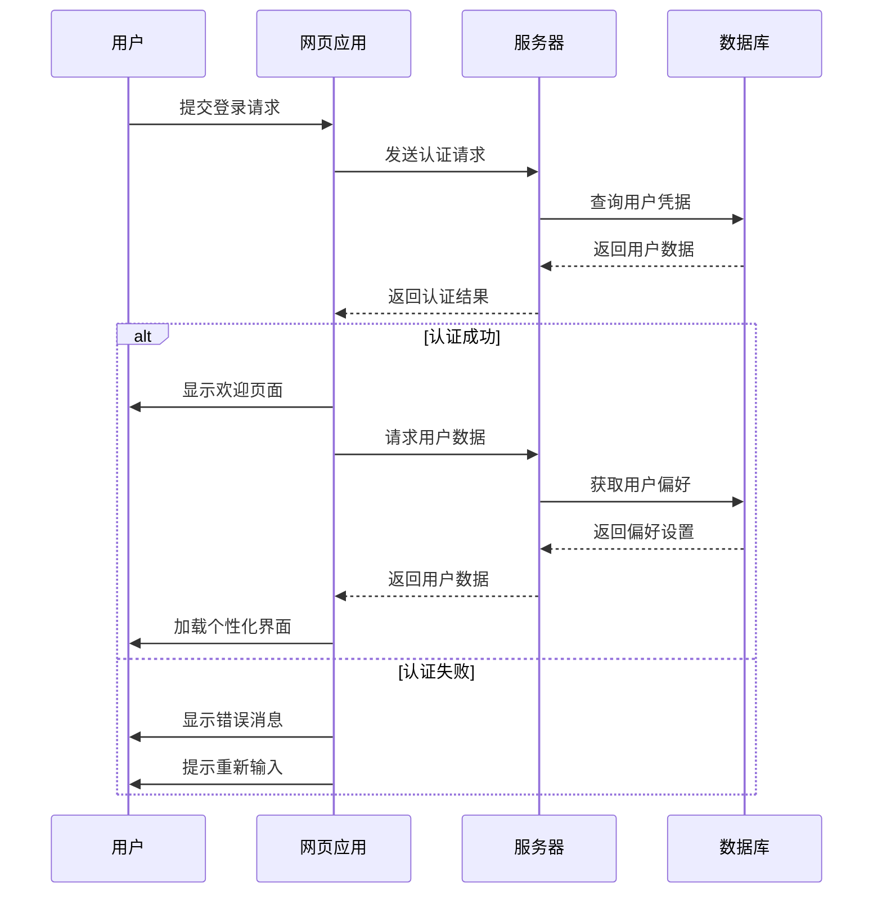

## ER 图示例

ER 图（实体关系图）非常适合表示数据库结构。

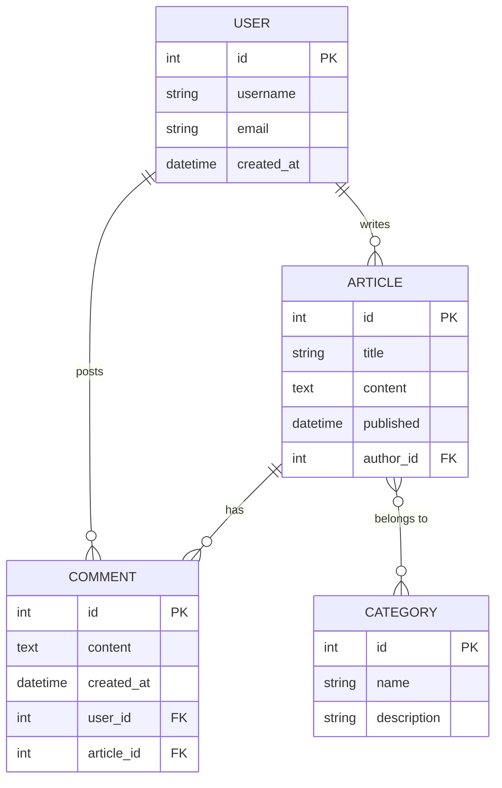

## 类图示例

类图显示系统的静态结构，包括类、属性、方法及其关系。

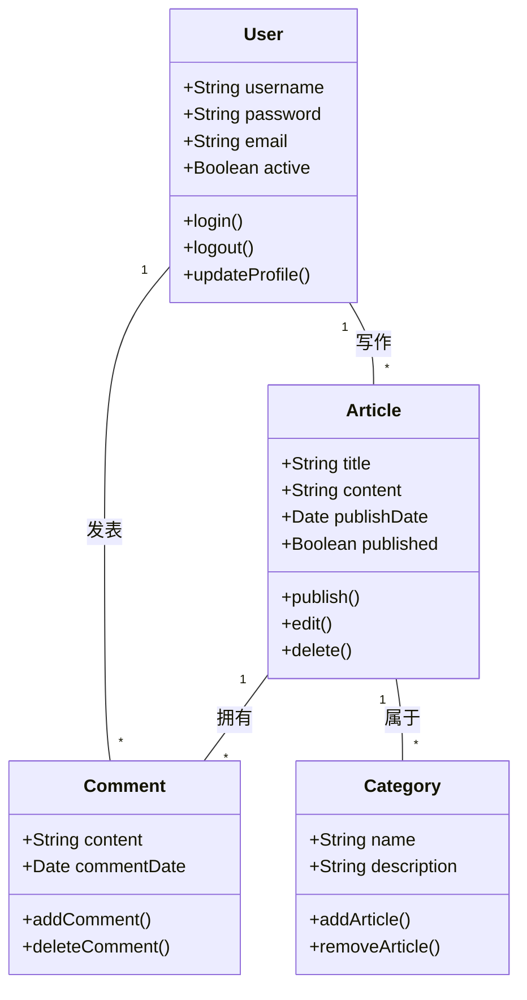

## 状态图示例

状态图显示对象在其生命周期中经历的状态序列。

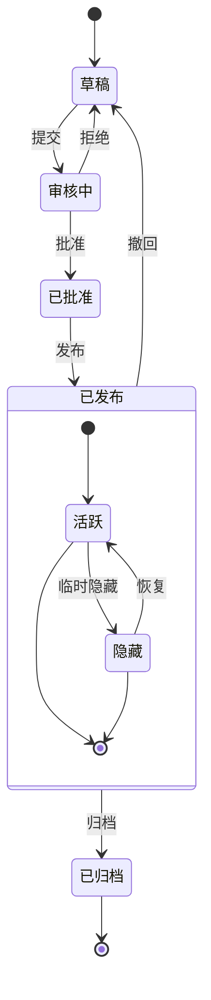

## XY 图示例

XY 图表非常适合展示趋势和对比数据。

```mermaid
xychart-beta
    title "月度访问量趋势"
    x-axis [1月, 2月, 3月, 4月, 5月, 6月]
    y-axis "访问量" 0 --> 5000
    bar [2500, 3200, 4100, 3800, 4500, 4800]
    line [2500, 3200, 4100, 3800, 4500, 4800]
```

## 饼图示例

饼图适合直观展示各部分在整体中的占比。

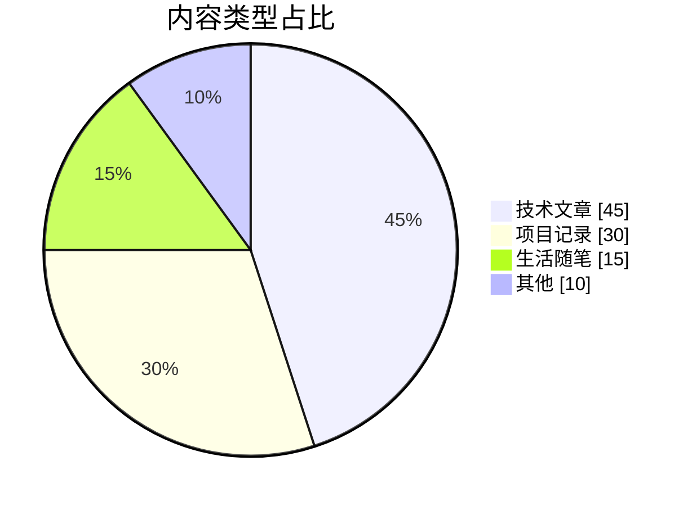

## 甘特图示例

甘特图可以按时间轴展示项目阶段、任务依赖和当前进度。

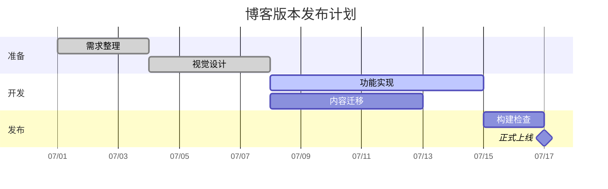

## 思维导图示例

思维导图适合梳理主题层级和知识结构。

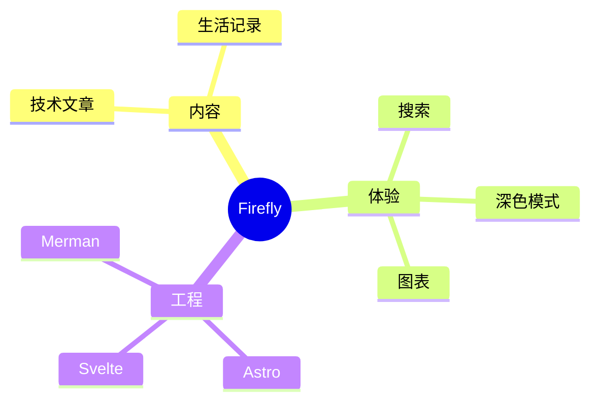

## 时间线示例

时间线用于按年份或阶段呈现项目的重要事件。

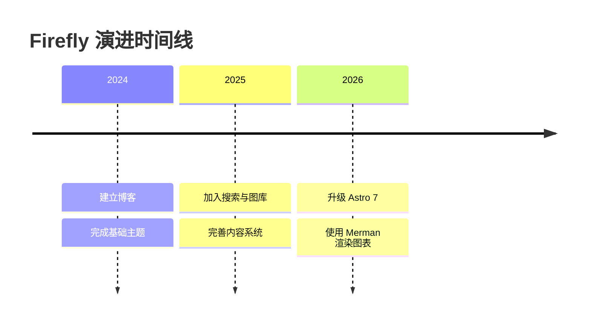

## 用户旅程图示例

用户旅程图能够描述用户在不同阶段的行为和体验评分。

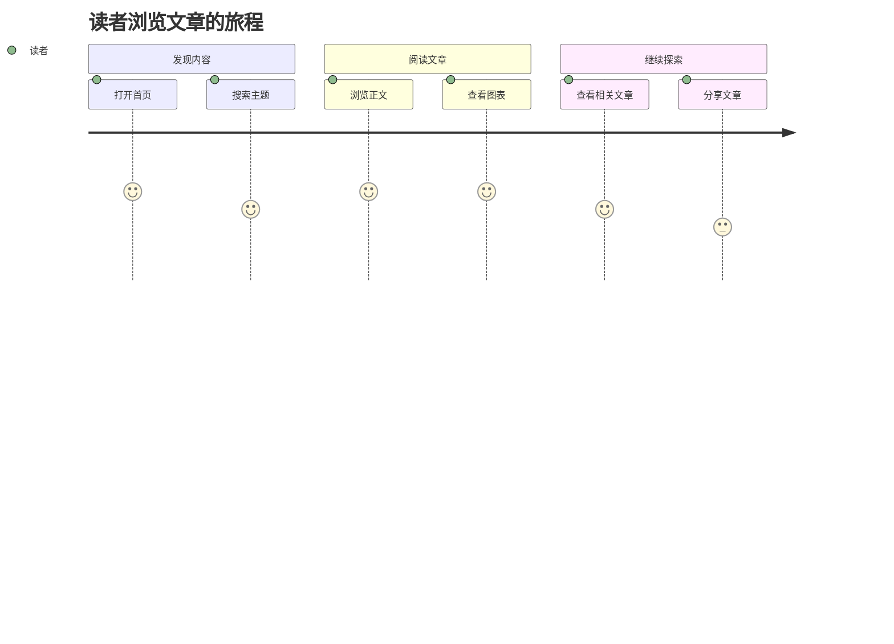

## Git 图示例

Git 图可以清晰展示分支、提交和合并历史。

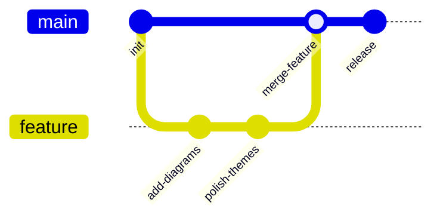

## 看板示例

看板适合展示任务在不同工作阶段之间的分布。

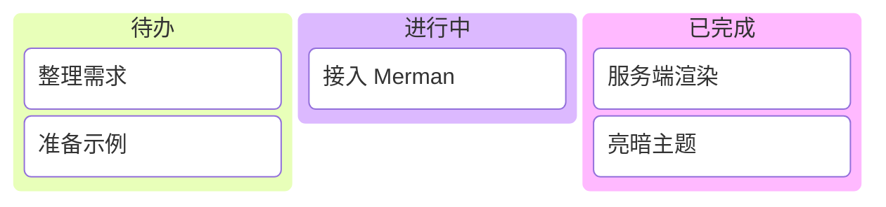

## Sankey 图示例

Sankey 图通过连线宽度展示流量在不同节点之间的流向。

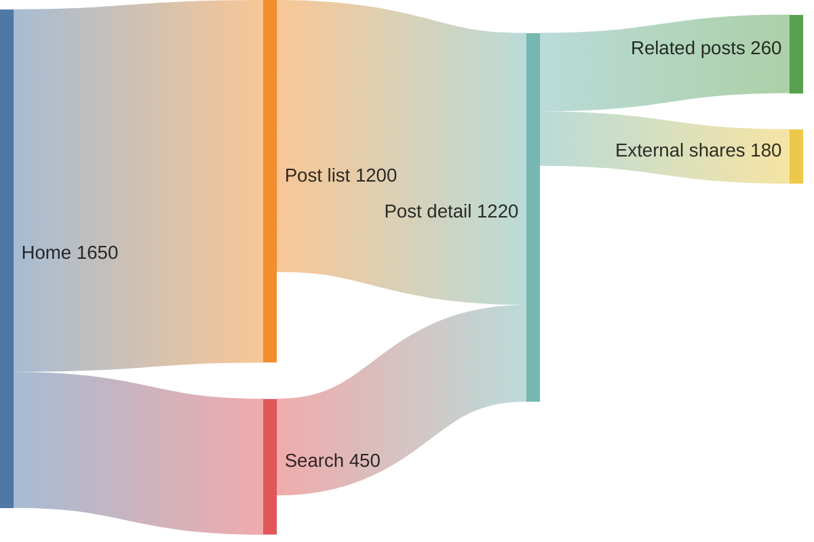

## 总结

Mermaid 是在 Markdown 文档中创建各种类型图表的强大工具。本文演示了流程图、时序图、ER 图、类图、状态图、XY 图、饼图、甘特图、思维导图、时间线、用户旅程图、Git 图、看板和 Sankey 图。这些图表可以帮助您更清晰地表达复杂的概念、流程和数据结构。

要使用 Mermaid，只需在代码块中指定 mermaid 语言，并使用简洁的文本语法描述图表。图表会在构建时自动渲染为 SVG，无需客户端 JavaScript 加载。

可以前往 [Merman Playground](http://frankorz.com/merman/) 尝试更多语法，再将图表代码粘贴到文章中。


---

## Markdown PlantUML 图表

## Markdown 中 PlantUML 图表指南

PlantUML 是一种使用纯文本描述图表的工具。你只需要写一段结构化语法，就可以生成时序图、类图、用例图、活动图等常见工程图。

它特别适合写在技术博客和项目文档里：

- 图表和正文一起版本管理，便于协作与审阅
- 修改图只需要改文本，适合频繁迭代
- 能和 Markdown 无缝结合，保持文档统一

在 Firefly 中，`plantuml` 代码块会在构建阶段编码并生成服务器 SVG 地址，页面端再根据亮暗主题自动切换图源，并支持缩放、拖拽和全屏交互。

如果你想快速上手，可以记住这个最小模板：

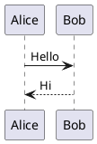

## 活动图示例

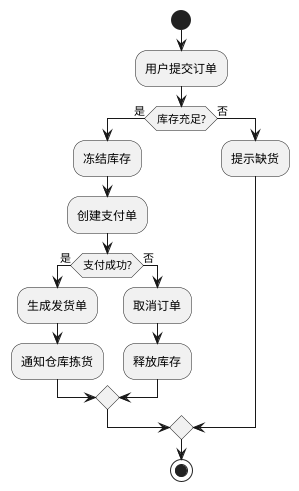

## 状态图示例

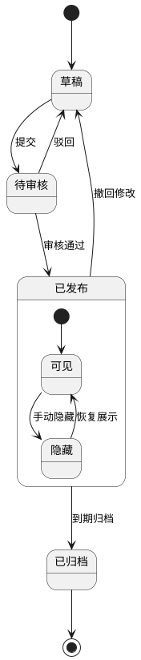

## 用例图示例

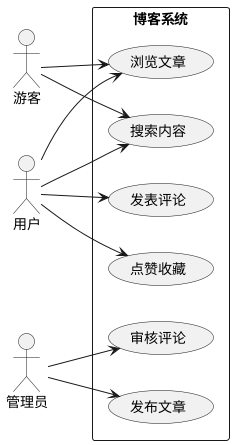

## 组件图示例

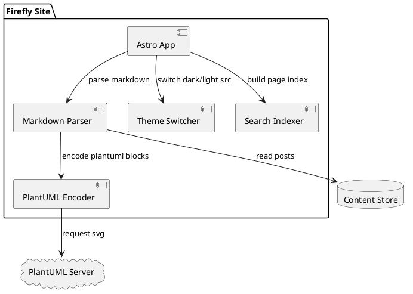

## 部署图示例

```plantuml
@startuml
node "User Device" {
	artifact "Browser"
}

node "CDN / Edge" {
	artifact "Static Assets"
}

node "Cloudflare Worker" {
	artifact "SSR Handler"
}

node "PlantUML Service" {
	artifact "SVG Renderer"
}

database "Object Storage" {
	artifact "Markdown Content"
}

"Browser" --> "Static Assets" : GET js/css/img
"Browser" --> "SSR Handler" : request page
"SSR Handler" --> "Markdown Content" : read post
"Browser" --> "SVG Renderer" : fetch diagram svg
@enduml
```

## ER 图示例

```plantuml
@startuml
entity User {
	*id : uuid <<PK>>
	--
	username : varchar
	email : varchar
	created_at : datetime
}

entity Post {
	*id : uuid <<PK>>
	--
	author_id : uuid <<FK>>
	title : varchar
	content : text
	published_at : datetime
}

entity Comment {
	*id : uuid <<PK>>
	--
	post_id : uuid <<FK>>
	user_id : uuid <<FK>>
	body : text
	created_at : datetime
}

User ||--o{ Post : writes
User ||--o{ Comment : creates
Post ||--o{ Comment : has
@enduml
```

## 时序图示例（登录与刷新令牌）

```plantuml
@startuml
autonumber
actor User as 用户
participant Web as 前端页面
participant API as 网关接口
participant Auth as 认证服务
database Redis as 会话缓存

用户 -> 前端页面 : 输入账号密码并提交
前端页面 -> 网关接口 : POST /login
网关接口 -> 认证服务 : 校验凭据
认证服务 -> 会话缓存 : 写入 refresh_token
认证服务 --> 网关接口 : access_token + refresh_token
网关接口 --> 前端页面 : 200 登录成功

... access_token 过期 ...

前端页面 -> 网关接口 : POST /refresh
网关接口 -> 认证服务 : 校验 refresh_token
认证服务 -> 会话缓存 : 轮换 refresh_token
认证服务 --> 网关接口 : 新 access_token
网关接口 --> 前端页面 : 200 新令牌
@enduml
```

## C4 风格容器图示例

```plantuml
@startuml
!includeurl https://raw.githubusercontent.com/plantuml-stdlib/C4-PlantUML/master/C4_Container.puml

Person(user, "博客访客", "阅读文章与搜索内容")

System_Boundary(system, "Firefly Blog") {
	Container(web, "Web App", "Astro + Svelte", "渲染页面与交互")
	Container(worker, "SSR Worker", "Cloudflare Workers", "处理服务端渲染请求")
	ContainerDb(content, "Content Store", "Markdown / Object Storage", "存储文章与资源元数据")
	Container(search, "Search Index", "Pagefind", "提供全文检索")
}

System_Ext(plantuml, "PlantUML Server", "生成 SVG 图表")

Rel(user, web, "访问", "HTTPS")
Rel(web, worker, "请求 SSR 页面", "HTTPS")
Rel(worker, content, "读取文章")
Rel(web, search, "查询关键词")
Rel(web, plantuml, "请求图表 SVG")

LAYOUT_LEFT_RIGHT()
@enduml
```


---

## Markdown 教程

这是一个展示如何编写 Markdown 文件的示例。本文档汇总了核心语法与常见扩展（GFM）。

- [块级元素](#block-elements)
    - [段落与换行](#paragraphs-and-line-breaks)
    - [标题](#headers)
    - [引用](#blockquotes)
    - [列表](#lists)
    - [代码块](#code-blocks)
    - [分割线](#horizontal-rules)
    - [表格](#table)
- [内联元素](#span-elements)
    - [链接](#links)
    - [强调](#emphasis)
    - [行内代码](#code)
    - [图片](#images)
    - [删除线](#strikethrough)
- [杂项](#miscellaneous)
    - [自动链接](#automatic-links)
    - [反斜杠转义](#backslash-escapes)
- [内联 HTML](#inline-html)

<a id="block-elements"></a>
## 块级元素

<a id="paragraphs-and-line-breaks"></a>
### 段落与换行

#### 段落

HTML 标签：`<p>`

使用一个或多个空行分隔段落。（仅包含**空格**或**制表符**的行也视为空行。）

代码：

    This will be
    inline.

    This is second paragraph.

预览：

---

This will be
inline.

This is second paragraph.

---

#### 换行

HTML 标签：`<br />`

在行末添加**两个或更多空格**来产生换行。

代码：

    This will be not
    inline.

预览：

---

This will be not  
inline.

---

<a id="headers"></a>
### 标题

Markdown 支持两种标题样式：Setext 与 atx。

#### Setext

HTML 标签：`<h1>`，`<h2>`

使用**等号 (=)** 表示 `<h1>`、使用**短横线 (-)** 表示 `<h2>`，数量不限，作为“下划线”。

代码：

    This is an H1
    =============
    This is an H2
    -------------

预览：

---

# This is an H1

## This is an H2

---

#### atx

HTML 标签：`<h1>`，`<h2>`，`<h3>`，`<h4>`，`<h5>`，`<h6>`

在行首使用 1-6 个**井号 (#)**，对应 `<h1>` 至 `<h6>`。

代码：

    # This is an H1
    ## This is an H2
    ###### This is an H6

预览：

---

# This is an H1

## This is an H2

###### This is an H6

---

可选：你可以在行尾“闭合” atx 标题。末尾的井号数量**不必与**开头一致。

代码：

    # This is an H1 #
    ## This is an H2 ##
    ### This is an H3 ######

预览：

---

# This is an H1

## This is an H2

### This is an H3

---

<a id="blockquotes"></a>
### 引用

HTML 标签：`<blockquote>`

Markdown 使用邮件风格的 **>** 作为引用符号。若手动换行并在每行前加 >，显示效果最佳。

代码：

    > This is a blockquote with two paragraphs. Lorem ipsum dolor sit amet,
    > consectetuer adipiscing elit. Aliquam hendrerit mi posuere lectus.
    > Vestibulum enim wisi, viverra nec, fringilla in, laoreet vitae, risus.
    >
    > Donec sit amet nisl. Aliquam semper ipsum sit amet velit. Suspendisse
    > id sem consectetuer libero luctus adipiscing.

预览：

---

> This is a blockquote with two paragraphs. Lorem ipsum dolor sit amet,
> consectetuer adipiscing elit. Aliquam hendrerit mi posuere lectus.
> Vestibulum enim wisi, viverra nec, fringilla in, laoreet vitae, risus.
>
> Donec sit amet nisl. Aliquam semper ipsum sit amet velit. Suspendisse
> id sem consectetuer libero luctus adipiscing.

---

Markdown 允许“偷懒”：在一个硬换行段落中，只在第一行前加 > 即可。

代码：

    > This is a blockquote with two paragraphs. Lorem ipsum dolor sit amet,
    consectetuer adipiscing elit. Aliquam hendrerit mi posuere lectus.
    Vestibulum enim wisi, viverra nec, fringilla in, laoreet vitae, risus.

    > Donec sit amet nisl. Aliquam semper ipsum sit amet velit. Suspendisse
    id sem consectetuer libero luctus adipiscing.

预览：

---

> This is a blockquote with two paragraphs. Lorem ipsum dolor sit amet,
> consectetuer adipiscing elit. Aliquam hendrerit mi posuere lectus.
> Vestibulum enim wisi, viverra nec, fringilla in, laoreet vitae, risus.

> Donec sit amet nisl. Aliquam semper ipsum sit amet velit. Suspendisse
> id sem consectetuer libero luctus adipiscing.

---

引用可以嵌套（引用中的引用），通过增加 > 层级实现。

代码：

    > This is the first level of quoting.
    >
    > > This is nested blockquote.
    >
    > Back to the first level.

预览：

---

> This is the first level of quoting.
>
> > This is nested blockquote.
>
> Back to the first level.

---

引用内可包含其他 Markdown 元素，包括标题、列表与代码块。

代码：

    > ## This is a header.
    >
    > 1.   This is the first list item.
    > 2.   This is the second list item.
    >
    > Here's some example code:
    >
    >     return shell_exec("echo $input | $markdown_script");

预览：

---

> ## This is a header.
>
> 1.  This is the first list item.
> 2.  This is the second list item.
>
> Here's some example code:
>
>     return shell_exec("echo $input | $markdown_script");

---

<a id="lists"></a>
### 列表

Markdown 支持有序（数字）与无序（圆点）列表。

#### 无序列表

HTML 标签：`<ul>`

无序列表可使用 **星号 (\*)**、**加号 (+)** 或 **短横线 (-)**。

代码：

    *   Red
    *   Green
    *   Blue

预览：

---

- Red
- Green
- Blue

---

等价于：

代码：

    +   Red
    +   Green
    +   Blue

或者：

代码：

    -   Red
    -   Green
    -   Blue

#### 有序列表

HTML 标签：`<ol>`

有序列表使用数字加英文句点：

代码：

    1.  Bird
    2.  McHale
    3.  Parish

预览：

---

1.  Bird
2.  McHale
3.  Parish

---

注意：像下面这样可能会“意外触发”有序列表：

代码：

    1986. What a great season.

预览：

---

1986. What a great season.

---

你可以用**反斜杠转义 (\\)** 句点：

代码：

    1986\. What a great season.

预览：

---

1986\. What a great season.

---

#### 列表中的缩进内容

##### 列表项里的引用

在列表项内放置引用，需要将 > 符号整体缩进：

代码：

    *   A list item with a blockquote:

        > This is a blockquote
        > inside a list item.

预览：

---

- A list item with a blockquote:

  > This is a blockquote
  > inside a list item.

---

##### 列表项里的代码块

在列表项内放置代码块，需要缩进两层——**8 个空格**或**两个 Tab**：

代码：

    *   A list item with a code block:

            <code goes here>

预览：

---

- A list item with a code block:

      <code goes here>

---

##### 嵌套列表

代码：

    * A
      * A1
      * A2
    * B
    * C

预览：

---

- A
  - A1
  - A2
- B
- C

---

<a id="code-blocks"></a>
### 代码块

HTML 标签：`<pre>`

将代码块中的每行缩进至少**4 个空格**或**1 个制表符**。

代码：

    This is a normal paragraph:

        This is a code block.

预览：

---

This is a normal paragraph:

    This is a code block.

---

代码块会一直持续，直到遇到未缩进的行（或文末）。

在代码块内，**与号 (&)** 和尖括号 **(< >)** 会自动转为 HTML 实体。

代码：

        <div class="footer">
            &copy; 2004 Foo Corporation
        </div>

预览：

---

    <div class="footer">
        &copy; 2004 Foo Corporation
    </div>

---

下文的“围栏代码块”和“语法高亮”属于扩展语法，你也可以用它们来书写代码块。

#### 围栏代码块

使用成对的反引号围起来（如下所示），就不需要四空格缩进了。

代码：

    Here's an example:

    ```
    function test() {
      console.log("notice the blank line before this function?");
    }
    ```

预览：

---

Here's an example:

```
function test() {
  console.log("notice the blank line before this function?");
}
```

---

#### 语法高亮

在围栏代码块后添加可选的语言标识，即可启用语法高亮（参见支持语言列表）。

代码：

    ```ruby
    require 'redcarpet'
    markdown = Redcarpet.new("Hello World!")
    puts markdown.to_html
    ```

预览：

---

```ruby
require 'redcarpet'
markdown = Redcarpet.new("Hello World!")
puts markdown.to_html
```

---

<a id="horizontal-rules"></a>
### 分割线（水平线）

HTML 标签：`<hr />`
一行中放置**三个或以上的短横线 (-)、星号 (\*) 或下划线 (\_)**。符号之间允许有空格。

代码：

    * * *
    ***
    *****
    - - -
    ---------------------------------------
    ___

预览：

---

---

---

---

---

---

---

---

<a id="table"></a>
### 表格

HTML 标签：`<table>`

这是扩展语法。

用**竖线 (|)** 分隔列，用**短横线 (-)** 分隔表头，使用**冒号 (:)** 指定对齐方式。

两侧的**竖线 (|)** 与对齐可选。用于表头分隔时，每列至少需要 **3 个短横线**。

代码：

```
| Left | Center | Right |
|:-----|:------:|------:|
|aaa   |bbb     |ccc    |
|ddd   |eee     |fff    |

 A | B
---|---
123|456


A |B
--|--
12|45
```

预览：

---

| Left | Center | Right |
| :--- | :----: | ----: |
| aaa  |  bbb   |   ccc |
| ddd  |  eee   |   fff |

| A   | B   |
| --- | --- |
| 123 | 456 |

| A   | B   |
| --- | --- |
| 12  | 45  |

---

<a id="span-elements"></a>
## 内联元素

<a id="links"></a>
### 链接

HTML 标签：`<a>`

Markdown 支持两种链接样式：行内链接与引用式链接。

#### 行内链接

行内链接格式：`[文本](URL "标题")`

标题可选。

代码：

    This is [an example](http://example.com/ "Title") inline link.

    [This link](http://example.net/) has no title attribute.

预览：

---

This is [an example](http://example.com/ "Title") inline link.

[This link](http://example.net/) has no title attribute.

---

如果引用同一站点的本地资源，可以使用相对路径：

代码：

    See my [About](/about/) page for details.

预览：

---

See my [About](/about/) page for details.

---

#### 引用式链接

可以预定义链接引用。定义格式：`[id]: URL "标题"`

标题同样可选。引用时使用：`[文本][id]`

代码：

    [id]: http://example.com/  "Optional Title Here"
    This is [an example][id] reference-style link.

预览：

---

[id]: http://example.com/ "Optional Title Here"

This is [an example][id] reference-style link.

---

说明：

- 方括号中包含链接标识（**不区分大小写**，可在左侧缩进最多三格空格）；
- 随后是冒号；
- 再跟一个或多个空格（或 tab）；
- 然后是链接 URL；
- URL 可选地用尖括号包裹；
- 可选地跟随标题属性，用引号或圆括号包裹。

以下三种定义等价：

代码：

    [foo]: http://example.com/  "Optional Title Here"
    [foo]: http://example.com/  'Optional Title Here'
    [foo]: http://example.com/  (Optional Title Here)
    [foo]: <http://example.com/>  "Optional Title Here"

如果使用空的方括号，则链接文本本身会作为名称。

代码：

    [Google]: http://google.com/
    [Google][]

预览：

---

[Google]: http://google.com/

[Google][]

---

<a id="emphasis"></a>
### 强调

HTML 标签：`<em>`，`<strong>`

Markdown 使用 **星号 (\*)** 或 **下划线 (\_)** 表示强调。**一个分隔符**对应 `<em>`；**两个分隔符**对应 `<strong>`。

代码：

    *single asterisks*

    _single underscores_

    **double asterisks**

    __double underscores__

预览：

---

_single asterisks_

_single underscores_

**double asterisks**

**double underscores**

---

但如果两侧有空格，则会被视作普通字符而非强调语法。

你可以使用反斜杠进行转义：

代码：

    \*this text is surrounded by literal asterisks\*

预览：

---

\*this text is surrounded by literal asterisks\*

---

<a id="code"></a>
### 行内代码

HTML 标签：`<code>`

用**反引号 (`)** 包裹。

代码：

    Use the `printf()` function.

预览：

---

Use the `printf()` function.

---

若行内代码中需要包含反引号字符，可使用**多重反引号**作为定界符：

代码：

    ``There is a literal backtick (`) here.``

预览：

---

``There is a literal backtick (`) here.``

---

行内代码两侧的定界符允许包含空格（开头一个、结尾一个），方便在代码起始或结尾放置反引号字符：

代码：

    A single backtick in a code span: `` ` ``

    A backtick-delimited string in a code span: `` `foo` ``

预览：

---

A single backtick in a code span: `` ` ``

A backtick-delimited string in a code span: `` `foo` ``

---

<a id="images"></a>
### 图片

HTML 标签：``

Markdown 的图片语法与链接类似，支持行内与引用两种方式。

#### 行内图片

行内图片语法：``

标题可选。

代码：

    

    

预览：

---


---

说明：

- 一个感叹号 !；
- 后接方括号，放置图片的替代文本；
- 再接圆括号，内含图片 URL/路径，及可选的标题（引号包裹）。

#### 引用式图片

引用式图片语法：`![替代文本][id]`

代码：

    [img id]: https://s2.loli.net/2024/08/20/5fszgXeOxmL3Wdv.webp  "Optional title attribute"
    ![Alt text][img id]

预览：

---

[img id]: https://s2.loli.net/2024/08/20/5fszgXeOxmL3Wdv.webp "Optional title attribute"

![Alt text][img id]

---

<a id="strikethrough"></a>
### 删除线

HTML 标签：`<del>`

这是扩展语法。

GFM 增加了删除线语法。

代码：

```
~~Mistaken text.~~
```

预览：

---

~~Mistaken text.~~

---

<a id="miscellaneous"></a>
## 杂项

<a id="automatic-links"></a>
### 自动链接

Markdown 支持一种便捷写法来创建“自动链接”（URL 与邮箱地址）：只需用尖括号将其包住即可。

代码：

    <http://example.com/>

    <address@example.com>

预览：

---

<http://example.com/>

<address@example.com>

---

GFM 会自动识别标准 URL 并转换为链接。

代码：

```
https://github.com/emn178/markdown
```

预览：

---

https://github.com/emn178/markdown

---

<a id="backslash-escapes"></a>
### 反斜杠转义

Markdown 允许使用反斜杠来转义那些本用于 Markdown 语法的特殊字符，使其按字面显示。

代码：

    \*literal asterisks\*

预览：

---

\*literal asterisks\*

---

以下字符可通过反斜杠转义以按字面量输出：

Code:

    \   backslash
    `   backtick
    *   asterisk
    _   underscore
    {}  curly braces
    []  square brackets
    ()  parentheses
    #   hash mark
    +   plus sign
    -   minus sign (hyphen)
    .   dot
    !   exclamation mark

<a id="inline-html"></a>
## 内联 HTML

对于 Markdown 语法未覆盖的标记，直接使用原生 HTML 即可。无需特别声明从 Markdown 切换到 HTML，直接写标签就行。

代码：

    This is a regular paragraph.

    <table>
        <tr>
            <td>Foo</td>
        </tr>
    </table>

    This is another regular paragraph.

预览：

---

This is a regular paragraph.

<table>
    <tr>
        <td>Foo</td>
    </tr>
</table>

This is another regular paragraph.

---

请注意：在**块级 HTML 标签**内不会处理 Markdown 语法。

与块级标签不同，在**行内级标签**内会处理 Markdown 语法。

代码：

    <span>**Work**</span>

    <div>
        **No Work**
    </div>

预览：

---

<span>**Work**</span>

<div>
  **No Work**
</div>
***


---

## MDX 格式文章示例

本文展示 Markdown 与 MDX 的区别。MDX 允许在 Markdown 中导入组件、使用 JSX 和导出变量；以下示例以代码块形式保留，避免影响本篇 Markdown 文章的构建。

## Markdown 和 MDX 的区别

- Markdown 适合以纯文本编写内容，语法简单、兼容性好。
- MDX 在 Markdown 基础上增加 JSX 和 JavaScript 能力，适合需要交互组件的场景。

| 特性 | Markdown | MDX |
| :--- | :--- | :--- |
| 基础语法 | 支持 CommonMark | 支持 CommonMark |
| HTML 标签 | 支持普通 HTML | 支持 JSX |
| 组件导入 | 不支持 | 支持 |
| 动态数据 | 不支持 | 支持 |

## 使用组件

```mdx
import { Icon } from "astro-icon/components";

<Icon name="fa7-solid:rocket" />
```

## 使用 JSX

```mdx
<div className="p-4">
  这是一个自定义样式的 div。
</div>
```

## 简单的变量导出

```mdx
export const year = new Date().getFullYear();
```

更多信息请查看 [MDX 文档](https://mdxjs.com/)。


---

## 在文章中嵌入视频

只需从 YouTube 或其他平台复制嵌入代码，然后将其粘贴到 markdown 文件中。

```yaml
---
title: 在文章中嵌入视频
published: 2023-10-19
// ...
---

<iframe width="100%" height="468" src="https://www.youtube.com/embed/5gIf0_xpFPI?si=N1WTorLKL0uwLsU_" title="YouTube video player" frameborder="0" allowfullscreen></iframe>
```
## YouTube

<iframe width="100%" height="468" src="https://www.youtube.com/embed/5gIf0_xpFPI?si=N1WTorLKL0uwLsU_" title="YouTube video player" frameborder="0" allow="accelerometer; autoplay; clipboard-write; encrypted-media; gyroscope; picture-in-picture; web-share" allowfullscreen></iframe>

## Bilibili

<iframe width="100%" height="468" src="//player.bilibili.com/player.html?bvid=BV1fK4y1s7Qf&p=1&autoplay=0" scrolling="no" border="0" frameborder="no" framespacing="0" allowfullscreen="true" &autoplay=0> </iframe>
